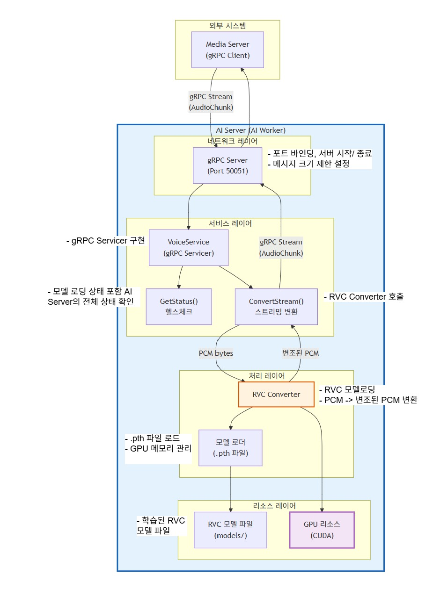

# AI 서버 진행상황

# 아키텍처

## 개요

AI Worker 서버는 Media Server와 gRPC를 통해 실시간 오디오 스트림을 주고받으며, RVC 모델을 사용한 음성 변환을 담당합니다.

## 완료된 작업

### 1. gRPC 서버 인프라 구축
- 파일: app/server.py
- 구현 내용:
  - VoiceService gRPC 서비스 클래스 구현
  - 비동기 gRPC 서버 구동 (grpc.aio.server)
  - Graceful shutdown 처리 (Ctrl+C 시그널 핸들링)
  - 메시지 크기 제한 설정 (16MB) - 오디오 스트리밍을 위한 설정

### 2. gRPC 통신 인터페이스 정의
- 파일: proto/voice.proto
- 구현 내용:
  - VoiceService 서비스 정의
  - GetStatus RPC: 서버 상태 확인 (헬스 체크)
  - ConvertStream RPC: 양방향 스트리밍 오디오 변환
  - AudioChunk 메시지: PCM 오디오 데이터, 샘플레이트, 채널 정보

### 3. RPC 메서드 구현
- GetStatus:
  - 현재 상태: 항상 "READY" 반환
  - 향후: 모델 로딩 상태(LOADING/ERROR) 반영 예정

- ConvertStream:
  - 현재: Pass-through (입력 오디오를 그대로 반환)
  - 향후: RVC 변환 로직 통합 예정

### 4. 테스트 클라이언트
- 파일: app/client_test.py
- 기능: 
  - GetStatus 호출 테스트
  - ConvertStream 호출 테스트

## 진행 중 / 예정 작업

### 1. RVC 모델 통합 (예정)
- 담당: AI 팀
- 작업 내용:
  - app/rvc_converter.py 모듈 구현
  - RVC 모델 로딩 및 추론 로직
  - ConvertStream에서 RVC 변환 호출

### 2. Docker 환경 구축 (예정)
- 작업 내용:
  - Dockerfile 작성
  - docker-compose.yml 작성
  - 로컬 개발 환경 설정

### 3. 환경 변수 설정 (예정)
- 작업 내용:
  - 서버 호스트/포트 환경 변수화
  - 모델 경로 설정

### 4. 로깅 및 에러 핸들링 (예정)
- 작업 내용:
  - 구조화된 로깅 시스템
  - 예외 처리 강화
  - 메트릭 수집

### 5. GetStatus 로직 개선 (예정)
- 작업 내용:
  - 모델 로딩 상태 반영
  - GPU 상태 확인
  - 에러 상태 전달
