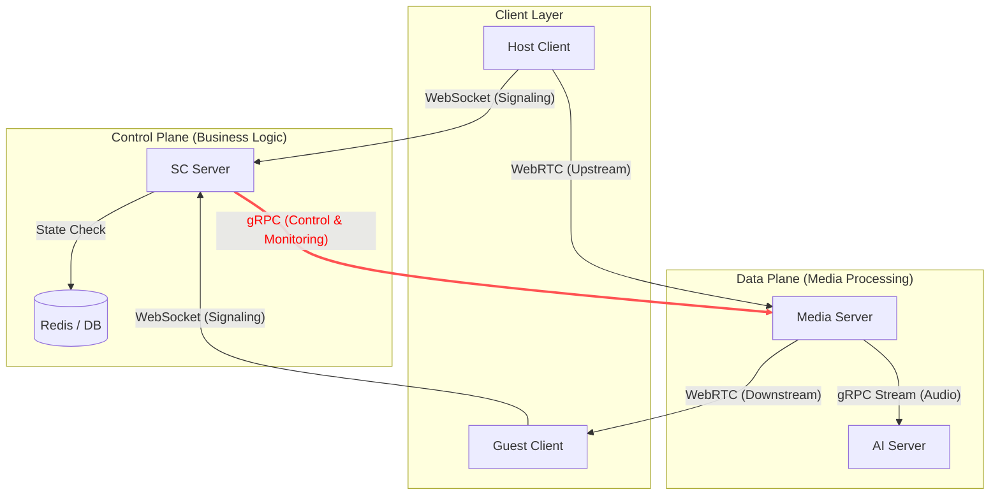
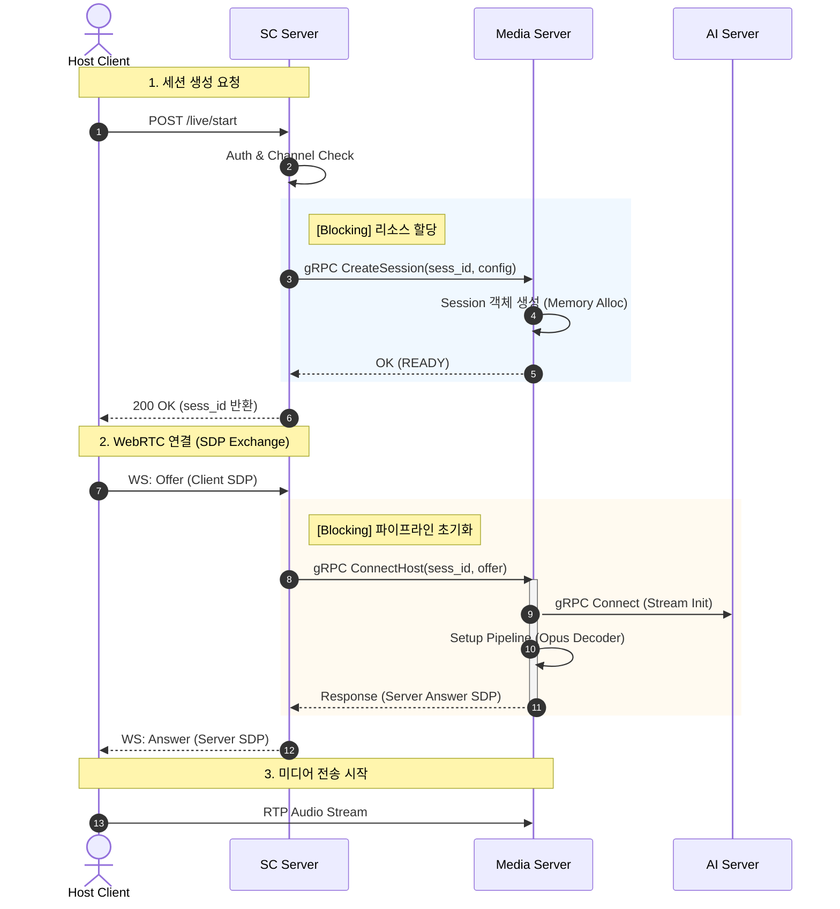
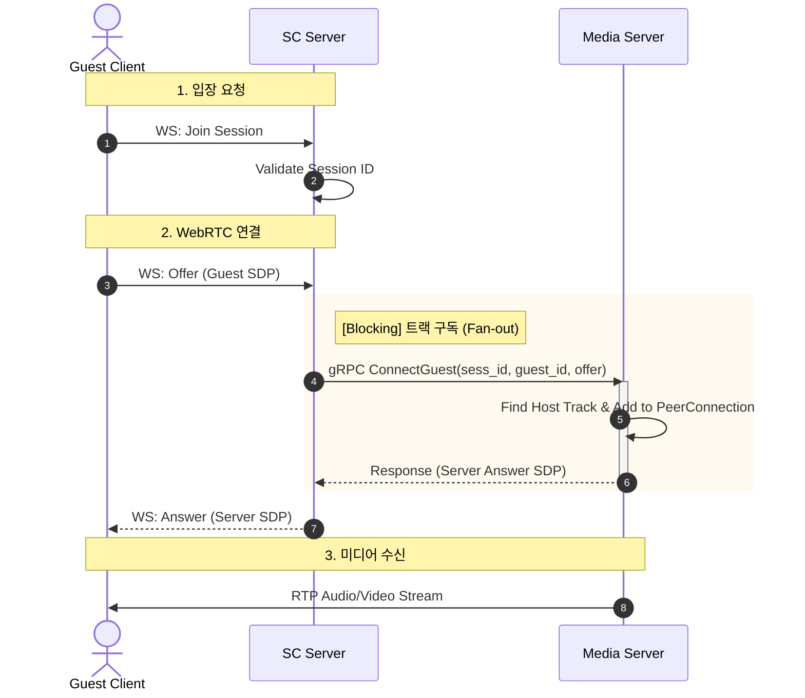
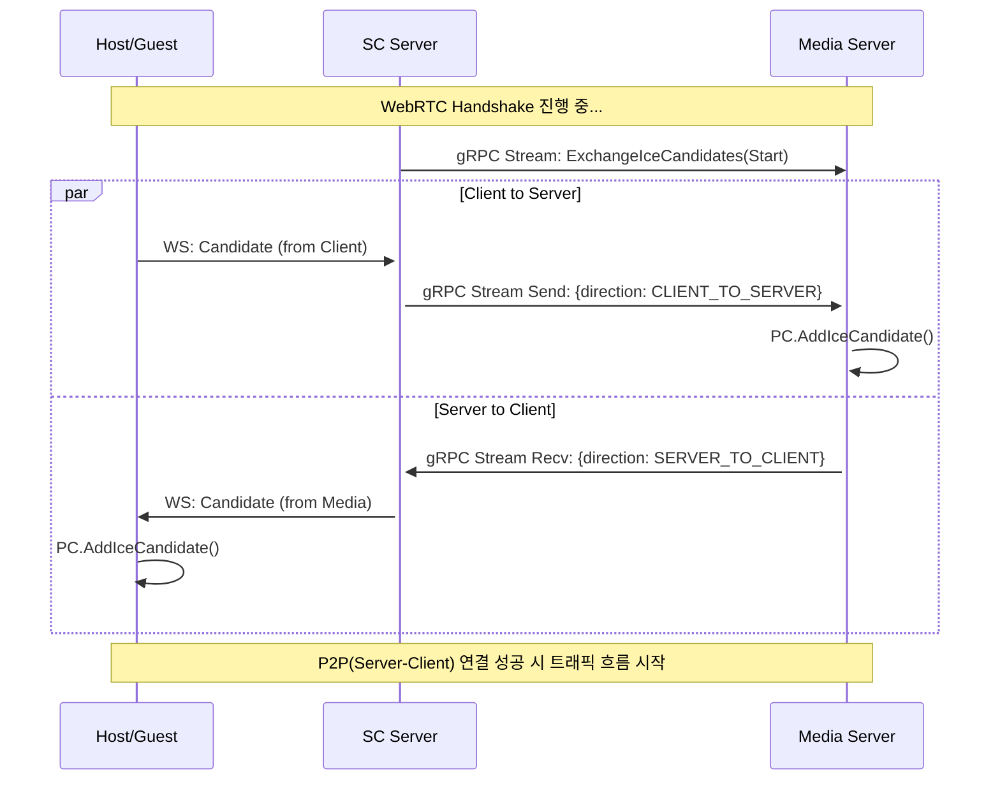
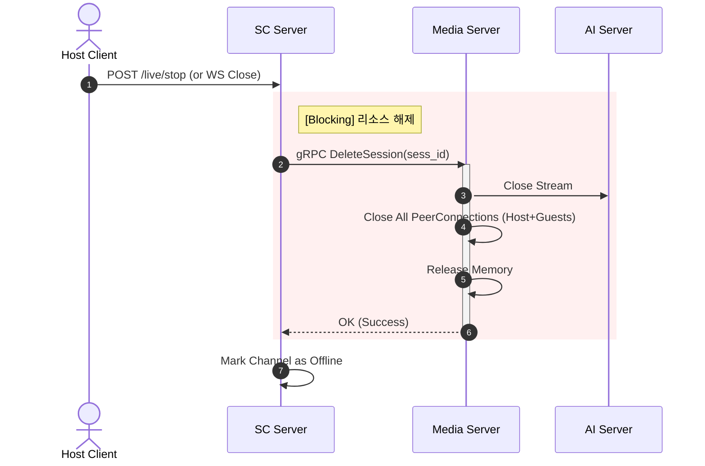

# Media - S&C

# 1. 개요

---

## 1.1 목적

본 문서는 Signaling & Control Server (이하 SC Server)와 Media Server 간의 통신 인터페이스를 정의하기 위해 작성되었습니다. 두 서버 간의 역할 책임(R&R)을 명확히 하고, gRPC 기반의 데이터 규격(Contract)과 통신 패턴(Blocking/Streaming)을 상세히 기술하여 개발 간의 불일치를 예방하는 것을 목적으로 합니다.

## 1.2 범위

본 문서는 다음 영역에 대한 인터페이스 명세를 포함합니다.

- **Session Lifecycle:** 방송 세션의 생성, 유지, 종료 관리
- **Connection Management:** Host(송출자) 및 Guest(시청자)의 WebRTC 연결 수립 (SDP Offer/Answer)
- **Real-time Signaling:** ICE Candidate 교환을 위한 양방향 스트리밍
- **Monitoring:** 서버 상태 및 리소스 점검 (Health Check)

## 1.3 용어 정의

혼동을 피하기 위해 본 프로젝트에서 사용하는 핵심 용어를 다음과 같이 정의합니다.

| **용어** | **정의** | **비고** |
| --- | --- | --- |
| **Channel ID** | 유저 고유의 영구적인 채널 식별자 (예: `gpsrlin123`) |  |
| **Session ID** | 방송 시작 시 생성되고 종료 시 파기되는 휘발성 식별자 (UUID) |  |
| **SC Server** | 인증, 권한 관리, 세션 발급을 담당하는 Control Plane | Client의 진입점 |
| **Media Server** | WebRTC 트래픽 처리, 오디오 변환 파이프라인을 담당하는 Data Plane | SC의 명령을 수행 |
| **Host** | 방송을 송출하는 클라이언트 (Audio Input Source) | 1 Session = 1 Host |
| **Guest** | 방송을 시청하는 클라이언트 (Subscribers) | 1 Session = N Guests |
| **Trickle ICE** | WebRTC 연결 중 발생하는 네트워크 후보(Candidate)를 실시간으로 교환하는 방식 | Streaming 사용 |

# 2. 시스템 아키텍처

---

## 2.1 통신 토폴로지

전체 라이브 스트리밍 서비스는 Control Plane(제어 계층)과 Data Plane(데이터 계층)으로 명확히 분리된 구조를 가집니다. SC Server는 중앙에서 모든 비즈니스 로직과 흐름을 제어하며, Media Server는 오직 미디어 트래픽 처리와 AI 연동에 집중합니다.

- **적색 굵은 선 (gRPC):** 본 문서에서 정의하는 인터페이스 범위입니다. SC Server는 Media Server의 API를 호출하는 **Client** 역할을 수행합니다.



## 2.2 역할 및 책임

시스템의 안정성과 확장성을 위해 두 서버의 책임 경계를 명확히 설정합니다.

| **구분** | **Signaling & Control Server** | **Media Server** |
| --- | --- | --- |
| **핵심 역할** | 제어 및 정책 결정 | 미디어 처리 및 실행 |
| **세션 관리** | - Channel ID 검증 및 권한 확인 (Auth)
- Session ID 발급 및 생명주기 관리
- 중복 방송 방지 로직 수행 | - 할당된 Session ID에 대한 메모리 객체 생성/해제
- 실제 물리적 리소스(Pipeline) 할당 |
| **WebRTC** | - SDP/ICE 메시지의 단순 중계 (Pass-through)
- TURN/STUN 서버 자격증명 발급 | - DTLS 핸드쉐이크 및 SRTP 암호화/복호화
- ICE Candidate 수집 및 연결 수립 |
| **트래픽** | - 텍스트 기반으로 시그널링 트래픽 처리 (WebSocket) | - 대용량 UDP/RTP 미디어 트래픽 처리
- 오디오 디코딩/리샘플링 및 AI 서버 연동 |
| **상태 저장** | - Stateless 지향 (Redis 등을 통해 상태 공유) | - Stateful (특정 세션은 특정 서버 메모리에 존재)
- 따라서 SC는 세션이 위치한 Media 서버를 알고 있어야 함 |

## 2.3 설계 원칙

본 인터페이스 설계 시 준수해야 할 핵심 원칙은 다음과 같습니다.

1. **Dumb Media Server:** 미디어 서버는 비즈니스 로직(예: 유저 레벨 확인, 과금 여부 등)을 알지 못하며, 오직 SC Server의 gRPC 명령에 따라서만 동작합니다.
2. **Context Isolation:** 모든 요청은 `Session ID`를 포함해야 합니다. 미디어 서버는 `Channel ID`(영속적 정보)보다 `Session ID`(현재 실행 문맥)를 우선하여 처리합니다.
3. **Explicit Resource Control:** 미디어 서버는 스스로 세션을 생성하거나 삭제하지 않습니다. 반드시 SC Server의 명시적인 RPC 호출(`CreateSession`, `DeleteSession`)에 의해서만 리소스 라이프사이클이 변경됩니다.

## 2.4 확장성 및 라우팅 전략 (Scalability & Routing Strategy)

Media Server는 세션 상태(WebRTC 연결, 파이프라인 등)를 메모리에 유지하는 Stateful 서버입니다. 따라서 일반적인 L4/L7 로드밸런서(Round-robin 등)를 사용할 수 없으며, Client-side Discovery 패턴을 적용해야 합니다.

### 1) 서버 식별 (Server Identification)

- 모든 Media Server 인스턴스는 구동 시 고유한 `Media Server ID` (예: `media-node-01`, UUID 등)를 가집니다.
- 각 서버는 자신의 접근 가능한 IP, gRPC Port, 현재 부하 상태(세션 수)를 Service Registry (Redis 등)에 주기적으로 등록/갱신(Heartbeat)해야 합니다.

### 2) 세션 라우팅 로직 (Session Routing Logic)

SC Server는 미디어 서버 클러스터와 통신할 때 다음 라우팅 규칙을 따릅니다.

- 세션 생성 시 (`CreateSession`):
    - Service Registry를 조회하여 가용 상태이며 부하가 가장 적은(Least Loaded) Media Server를 선정합니다.
    - 선정된 서버에 RPC를 요청하고, "Session ID ↔ Media Server ID" 매핑 정보를 공유 저장소(Redis)에 저장합니다.
- 세션 제어 시 (`ConnectHost`, `DeleteSession` 등):
    - 요청된 `Session ID`가 어느 Media Server에 존재하는지 매핑 정보를 조회합니다.
    - 해당 Media Server 인스턴스의 IP/Port로 직접 gRPC 요청을 보냅니다.

# 3. 통신 프로토콜 및 패턴

---

## 3.1 기술 스택

- **Protocol:** gRPC over HTTP/2
- **Serialization:** Protocol Buffers v3 (proto3)
- **Encryption:** Internal Network(VPC) 내 통신이므로 `Insecure` 모드를 기본으로 하되, 운영 환경 정책에 따라 TLS 적용 가능.

## 3.2 호출 유형

Lifecycle, Connection, Signaling, Monitor의 4 종류로, 다음 챕터에서 다룹니다.

## 3.3 타임아웃 정책

Media Server의 일시적인 과부하가 SC Server 전체의 장애로 전파되는 것을 막기 위해, SC Server는 gRPC 클라이언트 호출 시 반드시 **Deadlines**를 설정해야 합니다.

> Note: Streaming RPC (ExchangeIceCandidates)에는 전체 타임아웃을 설정하지 않으며, 대신 네트워크 끊김 감지를 위한 Keepalive 설정을 권장합니다.
> 

| **구분** | **권장 타임아웃 (변경 가능)** | **근거** |
| --- | --- | --- |
| **Pipeline Init (`ConnectHost`)** | **3,000ms** | AI 서버 연동 및 초기 버퍼링 시간 고려 |
| **Signaling (`Create`/`ConnectGuest`)** | **1,000ms** | 일반적인 메모리 할당 및 로직 처리 |
| **Monitoring (`GetServerStats`)** | **500ms** | 빠른 상태 확인 및 Failover 판단 |

## 3.4 에러 처리

모든 RPC 응답은 gRPC 표준 상태 코드(`google.golang.org/grpc/codes`)를 따릅니다.

- **OK (0):** 성공
- **INVALID_ARGUMENT (3):** 잘못된 `Session ID` 형식 또는 필수 파라미터 누락
- **NOT_FOUND (5):** 해당 `Session ID`를 가진 세션이 이 서버 메모리에 없음 (라우팅 오류 가능성)
- **RESOURCE_EXHAUSTED (8):** 서버 부하로 인해 신규 세션 생성 불가
- **UNAVAILABLE (14):** 서버가 종료 중이거나(Draining), AI 서버와 연결 끊김

# 4. 서비스 인터페이스 명세

---

본 챕터에서는 `media.v1.MediaControlService`의 주요 RPC 메서드에 대한 상세 동작과 입출력 규격을 정의합니다. 모든 메시지 포맷은 Protobuf(`media_service.proto`) 정의를 따릅니다.

| **카테고리** | **메서드 (Method)** | **유형 (Type)** | **Blocking** | **설명 및 주의사항** | **R&R (SC 역할)** |
| --- | --- | --- | --- | --- | --- |
| **Lifecycle** | `CreateSession` | Unary | **Yes** | 메모리에 세션 객체를 생성합니다. 실패 시 재시도(Retry) 가능합니다. | **"방 만들어"** (리소스 할당 요청) |
|  | `DeleteSession` | Unary | **Yes** | 즉시 리소스를 해제합니다. 응답 대기 시간이 짧습니다. | **"방 없애"** (강제 종료) |
| **Connection** | `ConnectHost` | Unary | **Yes** | **[CRITICAL]** 가장 무거운 작업입니다. 오디오 디코더 및 AI 파이프라인을 초기화하므로 응답까지 수백 ms가 소요됩니다. | **"Host 연결해"** (SDP Offer 전달) |
|  | `ConnectGuest` | Unary | **Yes** | Host의 트랙을 복제(Fan-out)하여 연결합니다. 비교적 가볍습니다. | **"Guest 연결해"** (시청자 입장) |
|  | `DisconnectGuest` | Unary | **Yes** | 특정 시청자의 WebRTC 연결만 해제합니다. (세션은 유지됨) | **"Guest 내보내"** (시청자 퇴장) |
| **Signaling** | `ExchangeIceCandidates` | Bi-di Stream | **No** | **Long-lived Connection**입니다. 세션 유지 기간 동안 연결되어야 하며, 반드시 별도 고루틴(Async)에서 처리해야 합니다. | **"Candidate 중계해"** (파이프 역할) |
| **Monitor** | `GetServerStats` | Unary | **Yes** | 서버의 현재 부하 상태를 즉시 반환합니다. | **"너 얼마나 바빠?"** (라우팅 판단) |

## 4.1 세션 라이프사이클 관리

### `CreateSession`

방송 세션을 생성하고 미디어 서버의 메모리 리소스를 사전 할당합니다.

- **Request:** `session_id` (UUID), `channel_id`, `config` (Audio/Video 설정)
- **Response:** `status` (READY)
- **동작 방식 (Behavior):**
    1. SC Server가 발급한 `session_id`의 중복 여부를 확인합니다.
    2. `map[session_id]*Room` 객체를 생성하고 초기화합니다.
    3. 오디오 처리를 위한 버퍼 및 코덱 설정을 준비합니다.
- **주의사항:** 아직 WebRTC 연결이나 AI 파이프라인이 구동되는 단계는 아닙니다. 순수한 메모리 할당 단계입니다.

### `DeleteSession`

세션을 강제로 종료하고 모든 리소스를 해제합니다.

- **Request:** `session_id`
- **Response:** `success` (bool)
- **동작 방식 (Behavior):**
    1. 해당 세션에 연결된 Host 및 모든 Guest의 WebRTC 연결을 강제로 끊습니다 (`PC.Close()`).
    2. AI 서버로 향하는 gRPC 스트림을 종료합니다.
    3. 메모리 맵에서 세션 객체를 삭제합니다.

## 4.2 WebRTC 연결 관리

### `ConnectHost` (Critical)

방송 송출자(Host)의 WebRTC 연결을 수립합니다. 가장 많은 리소스를 소모하는 단계입니다.

- **Request:** `session_id`, `sdp_offer` (Host의 SDP)
- **Response:** `sdp_answer` (Media Server의 SDP)
- **동작 방식 (Behavior):**
    1. **Pipeline Init:** Opus 디코더, Resampler, AI 서버 연동 gRPC Client를 초기화합니다.
    2. **WebRTC Handshake:** Host의 SDP Offer를 받아 처리하고, Answer를 생성합니다.
    3. **Trickle ICE:** Answer 생성 시점까지 수집된 Local Candidate는 SDP에 포함하여 반환합니다.
- **⚠️ 성능 주의:** AI 파이프라인 초기화 및 SDP 생성 과정에서 **200ms ~ 1000ms**의 지연이 발생할 수 있습니다. (Blocking Call)

### `ConnectGuest`

방송 시청자(Guest)의 WebRTC 연결을 수립합니다.

- **Request:** `session_id`, `guest_id`, `sdp_offer`
- **Response:** `sdp_answer`
- **동작 방식 (Behavior):**
    1. **SFU Logic:** Host의 처리된 오디오/비디오 트랙(Track)을 찾아 Guest의 PeerConnection에 추가(AddTrack)합니다.
    2. Host가 아직 연결되지 않은 경우, 에러(`FAILED_PRECONDITION`)를 반환할 수 있습니다.

### `DisconnectGuest`

특정 시청자의 연결만 해제합니다.

- **Request:** `session_id`, `guest_id`
- **동작 방식:** 해당 `guest_id`에 매핑된 PeerConnection만 닫습니다. 세션 자체는 유지됩니다.

## 4.3 실시간 시그널링

### `ExchangeIceCandidates` (Stream)

WebRTC 연결 수립 도중 발생하는 ICE Candidate를 실시간으로 교환합니다.

- **Type:** **Bidirectional Streaming**
- **Request/Response:** `IceCandidateMessage`
    - `session_id`: 세션 식별자
    - `peer_id`: `host_channel_id` 또는 `guest_id`
    - `direction`: `CLIENT_TO_SERVER` (SC→Media) 또는 `SERVER_TO_CLIENT` (Media→SC)
    - `candidate`: WebRTC Candidate 정보
- **동작 방식 (Behavior):**
    - **Long-lived Connection:** 세션 생성 직후부터 종료 시까지 스트림을 유지해야 합니다.
    - SC Server는 Client로부터 받은 Candidate를 이 스트림을 통해 Media Server로 밀어넣습니다(`CLIENT_TO_SERVER`).
    - Media Server는 자체적으로 생성된 Candidate를 이 스트림을 통해 SC Server로 보냅니다(`SERVER_TO_CLIENT`).

## 4.4 모니터링 (Monitoring)

### `GetServerStats`

미디어 서버의 내부 상태를 조회합니다. (Load Balancing 및 Auto-scaling 판단용)

- **Response:**
    - `active_sessions`: 현재 활성 세션 수
    - `ai_server_connected`: AI 서버와의 연결 상태 (Bool)
    - `cpu/memory_usage`: 리소스 점유율
- **활용:** SC Server는 이 정보를 주기적으로 수집하여 `CreateSession` 시 라우팅 가중치로 사용합니다.

# 5. 주요 시퀀스 및 데이터 흐름

---

본 챕터에서는 **방송 시작(Host)**, **시청자 입장(Guest)**, **ICE 교환**, **방송 종료** 등 4가지 핵심 시나리오에 대한 서버 간 상호작용 흐름을 정의합니다.

## 5.1 방송 시작 시퀀스 (Host Broadcast Start)

Host 클라이언트가 방송을 시작하고, 미디어 서버에 오디오 파이프라인(Decoder -> AI -> Encoder)이 생성되는 과정입니다.



## 5.2 시청자 입장 시퀀스 (Guest Join)

이미 생성된 방송 세션에 시청자가 입장하여, Fan-out 된 미디어 스트림을 구독하는 과정입니다.



## 5.3 ICE Candidate 교환

WebRTC 연결 과정(5.1, 5.2)과 **병렬적**으로 수행됩니다. 네트워크 경로(Candidate)를 실시간으로 교환하기 위해 `ExchangeIceCandidates` 스트림을 사용합니다.

- 이 스트림은 세션이 종료될 때까지 유지되어야 하며, 네트워크 상태 변화(WiFi <-> LTE)로 인한 재연결(Ice Restart) 시에도 사용됩니다.
- ExchangeIceCandidates: WebRTC 핸드쉐이크를 시작하면서, 이 세션을 위한 ICE 교환 채널도 같이 연다



## 5.4 방송 종료 및 정리

Host가 방송을 종료하거나, 예기치 않게 연결이 끊겼을 때 리소스를 해제하는 과정입니다.



---

```protobuf
syntax = "proto3";

package media.v1;

option go_package = "lab.ssafy.com/s14-webmobile1-sub1/S14P11B103/apps/server-media/gen/media/v1";

// -----------------------------------------------------------------------------
// MediaControlService
// SC Server(Client) -> Media Server(Server)
// -----------------------------------------------------------------------------
service MediaControlService {
  // [Session Lifecycle]
  // 방송 세션을 생성하고 메모리를 할당합니다. (Blocking)
  rpc CreateSession (CreateSessionRequest) returns (CreateSessionResponse);
  
  // 세션을 강제 종료하고 리소스를 해제합니다. (Blocking)
  rpc DeleteSession (DeleteSessionRequest) returns (DeleteSessionResponse);

  // [WebRTC Connection]
  // Host(방송 송출자) 연결. AI 파이프라인이 초기화됩니다. (Blocking, High Latency)
  rpc ConnectHost (ConnectHostRequest) returns (ConnectHostResponse);
  
  // Guest(방송 시청자) 연결. (Blocking)
  rpc ConnectGuest (ConnectGuestRequest) returns (ConnectGuestResponse);
  
  // Guest 연결만 해제. (Blocking)
  rpc DisconnectGuest (DisconnectGuestRequest) returns (DisconnectGuestResponse);

  // [Signaling]
  // WebRTC ICE Candidate를 실시간 교환합니다. (Bi-directional Streaming)
  // 세션이 유지되는 동안 스트림을 유지해야 합니다. (Non-blocking / Async)
  rpc ExchangeIceCandidates (stream IceCandidateMessage) returns (stream IceCandidateMessage);

  // [Monitoring]
  // 서버 상태 및 부하 정보를 조회합니다. (Blocking)
  rpc GetServerStats (GetServerStatsRequest) returns (GetServerStatsResponse);
}

// -----------------------------------------------------------------------------
// Messages: Session Lifecycle
// -----------------------------------------------------------------------------

message CreateSessionRequest {
  string channel_id = 1; // 영구적인 채널 식별자 (DB 기준)
  string session_id = 2; // 이번 방송의 고유 식별자 (UUID)
  RtcConfig config = 3;  // 미디어 설정
}

message CreateSessionResponse {
  string session_id = 1;
  
  // [확장성] 요청을 처리한 미디어 서버의 고유 ID (예: "media-node-01")
  // SC는 이 ID와 session_id 매핑을 저장하여 이후 요청 라우팅에 사용해야 함.
  string media_server_id = 2; 
  
  SessionStatus status = 3;
}

message DeleteSessionRequest {
  string session_id = 1;
}

message DeleteSessionResponse {
  bool success = 1;
}

enum SessionStatus {
  SESSION_STATUS_UNSPECIFIED = 0;
  SESSION_STATUS_READY = 1;
  SESSION_STATUS_CREATING = 2;
}

message RtcConfig {
  AudioConfig audio = 1;
  VideoConfig video = 2;
}

message AudioConfig {
  AudioCodec codec = 1;
  int32 sample_rate = 2; // e.g. 48000
}

enum AudioCodec {
  AUDIO_CODEC_UNSPECIFIED = 0;
  AUDIO_CODEC_OPUS = 1;
}

message VideoConfig {
  bool enabled = 1;
  VideoResolution resolution = 2;
}

enum VideoResolution {
  VIDEO_RES_UNSPECIFIED = 0;
  VIDEO_RES_HD_720P = 1;
  VIDEO_RES_FHD_1080P = 2;
}

// -----------------------------------------------------------------------------
// Messages: WebRTC Connection
// -----------------------------------------------------------------------------

message ConnectHostRequest {
  string session_id = 1;
  string sdp_offer = 2; // Client SDP
}

message ConnectHostResponse {
  string sdp_answer = 1; // Server SDP (Candidates 포함 가능)
}

message ConnectGuestRequest {
  string session_id = 1;
  string guest_id = 2; // 시청자 식별자
  string sdp_offer = 3;
}

message ConnectGuestResponse {
  string sdp_answer = 1;
}

message DisconnectGuestRequest {
  string session_id = 1;
  string guest_id = 2;
}

message DisconnectGuestResponse {
  bool success = 1;
}

// -----------------------------------------------------------------------------
// Messages: ICE Signaling (Streaming)
// -----------------------------------------------------------------------------

message IceCandidateMessage {
  // 스트림 멀티플렉싱을 위한 세션 식별자
  string session_id = 1; 
  
  // Peer 식별자 (Host인 경우 channel_id, Guest인 경우 guest_id)
  string peer_id = 2;
  
  IceDirection direction = 3;
  RTCIceCandidate candidate = 4;
}

enum IceDirection {
  ICE_DIRECTION_UNSPECIFIED = 0;
  
  // SC -> Media (클라이언트의 Candidate를 미디어 서버에 전달)
  ICE_DIR_CLIENT_TO_SERVER = 1; 
  
  // Media -> SC (미디어 서버의 Candidate를 클라이언트에 전달)
  ICE_DIR_SERVER_TO_CLIENT = 2; 
}

message RTCIceCandidate {
  string candidate = 1;       // "candidate:842163049 1 udp..."
  string sdp_mid = 2;         // "0" or "video"
  int32 sdp_mline_index = 3;  // 0
  string username_fragment = 4; // (Optional) 디버깅용
}

// -----------------------------------------------------------------------------
// Messages: Monitoring
// -----------------------------------------------------------------------------

message GetServerStatsRequest {}

message GetServerStatsResponse {
  // [확장성] 모니터링 시 어떤 서버의 지표인지 식별
  string media_server_id = 1; 
  
  int32 active_sessions = 2;      // 현재 활성 방 개수
  int32 active_pipelines = 3;     // 돌아가고 있는 AI 변환 파이프라인 수
  bool ai_server_connected = 4;   // AI 서버 연동 상태
  
  // Load Balancing 가중치 계산용
  double cpu_usage_percent = 5;
  double memory_usage_percent = 6;
}
```