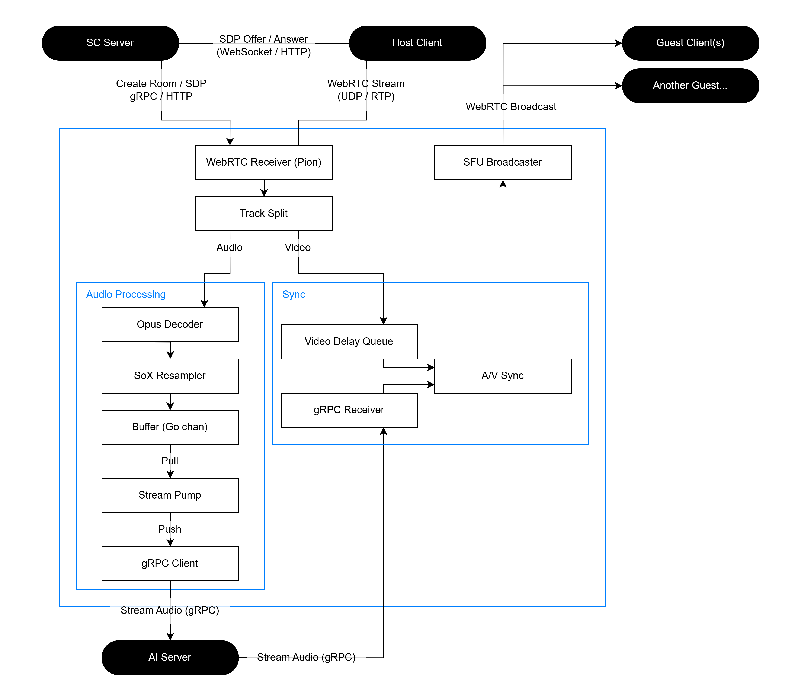

# Media 서버 진행 상황

# 아키텍처 개요

# 스프린트 1주차 - 완료 사항

## Audio Processing 모듈

1. [Step 1] 통신 규격 정의
    - gRPC Proto 파일 작성 및 프로젝트 구조 설정
2. [Step 2] 오디오 디코딩
    - `internal/audio/decoder.go`: Opus 패킷을 PCM(48kHz)으로 변환하는 기능 구현.
3. [Step 3] 오디오 리샘플링
    - `internal/audio/resampler.go`: 48kHz 데이터를 AI 모델용 16kHz로 변환하는 기능 구현 (`libsoxr` 사용).
4. [Step 4] WebRTC 수신부 구현
    - `internal/webrtc/receiver.go`: Pion 라이브러리로 SDP 협상 및 오디오 트랙 수신 로직 구현.
5. [Step 5] 파이프라인 통합
    - `internal/media/track.go`: `Receiver` -> `Decoder` -> `Resampler` -> `Buffer`로 이어지는 데이터 처리 흐름 완성.
    - Go Channel을 도입해 동시성 문제 해결.
6. [Step 6] gRPC 스트리밍 연동
    - 완성된 16kHz 오디오 데이터를 gRPC 클라이언트를 통해 Python AI 서버로 전송.

# 향후 로드맵

## 1. 제어부 및 시그널링 (Control Plane)

시스템 전체의 세션 관리 및 컴포넌트 간의 시그널링 규격을 정의한다.

- **gRPC Control Interface**: Signal 서버와 Media 서버 간의 세션 제어를 위해 양방향 스트리밍 또는 Unary RPC를 사용한다.
    - `CreateRoom`, `CloseRoom`: 미디어 리소스 할당 및 해제.
    - `SignalingProxy`: SDP Offer/Answer 및 ICE Candidate 전달.
- **Room Manager**: 서버 내 할당된 미디어 세션을 관리하는 싱글톤 모듈이다.
    - 고유 Room ID를 키로 하여 `PeerConnection` 객체 및 트랙 상태를 인메모리 관리한다.
    - 세션 생명주기(Life Cycle) 관리 및 타임아웃 처리를 담당한다.

## 2. 미디어 트랙 분리 (Media Ingestion)

수신된 WebRTC 스트림을 처리 목적에 따라 개별 트랙으로 분리하고 가공한다.

- **WebRTC Receiver (Pion)**: Host로부터 UDP/RTP 패킷을 수신하고 Payload를 추출한다.
- **Track Splitting**: 수신된 `MediaStream`에서 Audio와 Video 트랙을 분리하여 개별 파이프라인으로 라우팅한다.
    - **Audio**: 실시간 변조를 위해 AI 처리 파이프라인으로 전달한다.
    - **Video**: 오디오 처리 지연 시간에 대응하기 위해 동기화 큐(Delay Queue)로 전달한다.

## 3. [완료] AI 오디오 처리 파이프라인 (Audio Processing)

실시간 AI 변조를 위한 오디오 가공 및 외부 AI 서버와의 연동을 수행한다.

- **Audio Pipeline**:
    - **Opus Decoder**: 48kHz Opus RTP 패킷을 Raw PCM 데이터로 디코딩한다.
    - **SoX Resampler**: AI 모델 규격에 맞춰 48kHz 데이터를 16kHz로 리샘플링한다.
    - **Data Buffering**: Go Channel 및 Ring Buffer를 사용하여 오디오 데이터의 흐름을 제어하고 배압(Backpressure)을 관리한다.
- **AI Server Interworking**:
    - **gRPC Bidirectional Streaming**: AI 서버와 실시간으로 16kHz PCM 데이터를 교환한다.
    - **Stream Pump**: 버퍼링된 오디오 데이터를 주기적으로 gRPC 클라이언트에 Push한다.

## 4. 트랙 동기화 (A/V Synchronization)

AI 처리로 발생하는 레이턴시를 보정하여 오디오와 비디오의 싱크를 맞춘다.

- **Latency Calculation**: 오디오가 AI 서버로 송출된 시점부터 변조되어 돌아오는 시점까지의 평균 지연 시간(T)을 실시간 측정한다.
- **Video Delay Queue**: 산출된 지연 시간(T)만큼 비디오 RTP 패킷을 버퍼링하여 송출을 유예시킨다.
- **Lip-Sync Logic**: 가공된 오디오 트랙의 Timestamp와 지연된 비디오 트랙의 시퀀스를 정렬하여 최종 A/V Sync를 확보한다.

## 5. SFU 브로드캐스트 (Broadcasting & Fan-out)

처리 완료된 데이터를 다수의 수신자에게 효율적으로 전달한다.

| **구분** | **상세 내용** |
| --- | --- |
| **Track Muxing** | 변조된 Audio Track과 지연 보정된 Video Track을 결합하여 송출용 스트림 구성 |
| **Broadcaster** | SFU(Selective Forwarding Unit) 구조를 채택하여 1:N 방송 환경 구축 |
| **Fan-out** | Host의 미디어 데이터를 개별 Guest의 PeerConnection에 복제하여 전송 (Zero-copy 지향) |
| **Signaling** | Guest 입장 시 새로운 SDP 교환을 통해 하향(Downstream) 트랙 할당 |
