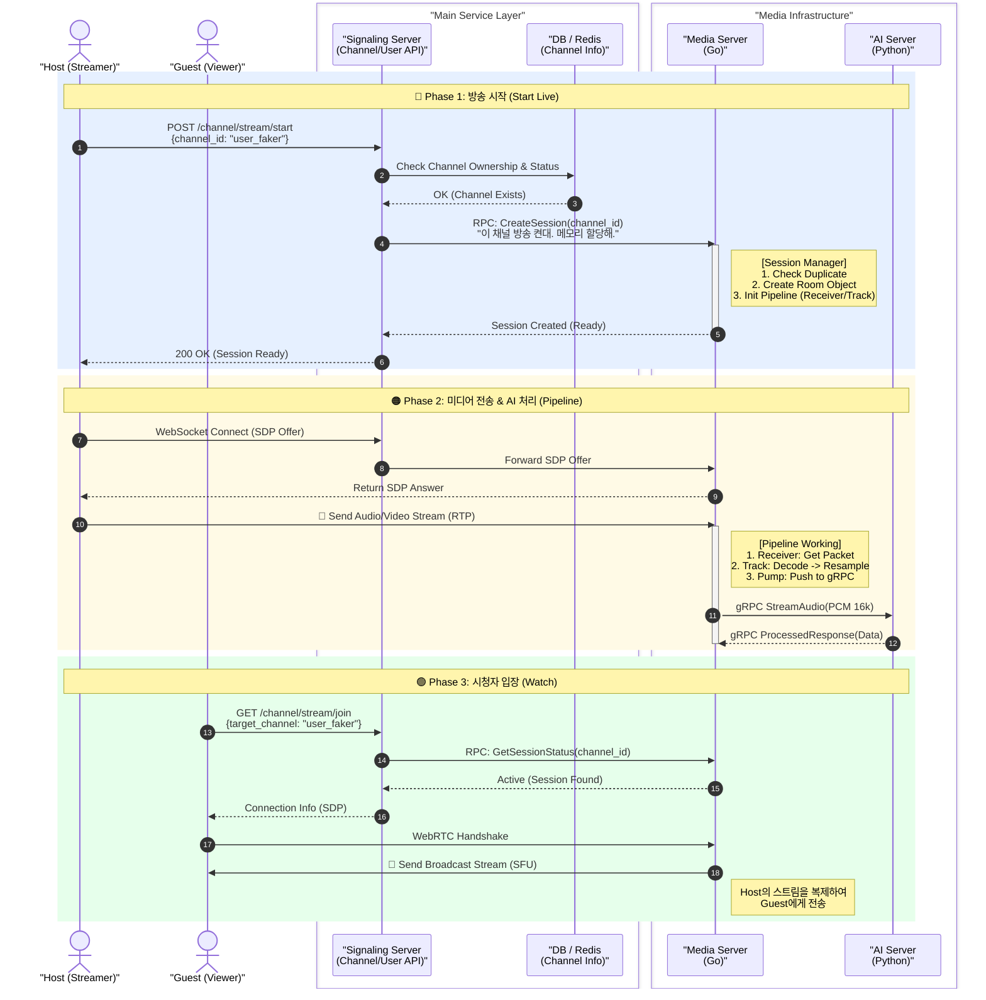

# CLIENT - SCS - MEDIA 통신규약 회의



```mermaid
sequenceDiagram
    autonumber
    %% Participants Definition
    actor Host as "Host Client"
    participant SC as "Signaling Server (SC)"
    participant Media as "Media Server"
    participant AI as "AI Server"

    %% =========================================================
    %% 1. Session Initialization
    %% =========================================================
    rect rgb(240, 248, 255)
        note over Host, Media: "1. Session Creation (REST & gRPC)"

        Host->>SC: "POST /api/v1/channels/{id}/live/start"
        note right of Host
            JSON Request Body:
            {
              "clientRequestId": "uuid-v4",
              "rtc": { "audio": true, "video": false }
            }
        end note

        SC->>Media: "gRPC: CreateSession"
        note right of SC
            Protobuf: CreateSessionRequest
            message {
              string channel_id = "user_faker";
              string request_id = "uuid-v4";
            }
        end note

        Media-->>SC: "gRPC: Response"
        note left of Media
            Protobuf: CreateSessionResponse
            message {
              string session_id = "sess_123";
              string status = "READY";
            }
        end note

        SC-->>Host: "200 OK"
        note left of SC
            JSON Response Body:
            {
              "live": { "sessionId": "sess_123" },
              "signaling": { "wsUrl": "wss://...", "token": "..." },
              "rtcConfig": { "iceServers": [...] }
            }
        end note
    end

    %% =========================================================
    %% 2. WebRTC Signaling
    %% =========================================================
    rect rgb(255, 250, 240)
        note over Host, Media: "2. WebRTC Signaling (WSS & gRPC)"

        Host->>SC: "WSS: Connect & JOIN"
        
        Host->>SC: "WSS: Send OFFER"
        note right of Host
            JSON Envelope:
            {
              "type": "OFFER",
              "sessionId": "sess_123",
              "payload": { "sdp": "v=0..." }
            }
        end note

        SC->>Media: "gRPC: ConnectHost"
        note right of SC
            Protobuf: ConnectHostRequest
            message {
              string session_id = "sess_123";
              string sdp_offer = "v=0...";
            }
        end note

        Media-->>SC: "gRPC: Response"
        note left of Media
            Protobuf: ConnectHostResponse
            message {
              string sdp_answer = "v=0...";
            }
        end note

        SC-->>Host: "WSS: Send ANSWER"
        note left of SC
            JSON Envelope:
            {
              "type": "ANSWER",
              "sessionId": "sess_123",
              "payload": { "sdp": "v=0..." }
            }
        end note
    end

    %% =========================================================
    %% 3. Media Pipeline & AI
    %% =========================================================
    rect rgb(240, 255, 240)
        note over Host, AI: "3. Media Streaming & AI Processing"

        Host->>Media: "UDP/RTP Stream (Opus Audio)"
        
        activate Media
        Media->>AI: "gRPC Stream: ConvertStream"
        note right of Media
            Protobuf: AudioChunk (Stream)
            message {
              bytes pcm = [Binary];
              int32 sample_rate = 16000;
              int32 channels = 1;
            }
        end note

        AI-->>Media: "gRPC Stream: Response"
        note left of AI
            Protobuf: AudioChunk (Stream)
            message {
              bytes pcm = [Processed Binary];
            }
        end note
        deactivate Media
    end
```

---

[구버전(참고용)](https://www.notion.so/2ea53fb3604380c88b99f32e4ef2b7bf?pvs=21)

아래 문서는 CLIENT 와 SCS간 합의할 방향(채널은 상시 존재, 라이브는 세션 인스턴스 / REST로 상태 전이, WSS는 WebRTC 시그널링 전용 / 이벤트 기반 타입 네이밍)을 기준으로, 팀이 그대로 참고해 구현할 수 있도록 작성한 **WebSocket 활용 문서**입니다.

---

# WebSocket 활용 문서 (Signaling WS Spec v1)

## 0. 목적과 범위

### 목적

이 문서는 우리 서비스에서 **WebSocket(WSS)** 을 왜 쓰는지, 무엇을 주고받는지, 어떤 이벤트를 처리해야 하는지, 그리고 서버/클라이언트가 어떤 규칙으로 구현해야 하는지를 “계약(Contract)” 수준으로 정의한다.

### 범위(중요)

- WebSocket은 **오직 WebRTC 시그널링(SDP/ICE) + WS 채널 운영 이벤트**를 위해 사용한다.
- 채널(대기실) 입장/퇴장, 방송 시작/종료, 시청 입장 등 **도메인 상태 전이**는 REST로 처리한다.
- 미디어 데이터(오디오/비디오)는 WebRTC(DTLS+SRTP)로 **Host/Guest ↔ Media Server** 간 직접 흐르고, WebSocket은 미디어를 운반하지 않는다.

---

## 1. WebSocket을 사용하는 이유와 이 서비스에서의 역할

### 1-1. 왜 WebSocket인가

WebRTC 연결을 성립시키기 위해서는 다음을 **실시간·양방향·다회성 이벤트**로 교환해야 한다.

- **SDP Offer/Answer**: 코덱/트랙/암호화 등 세션 파라미터 합의
- **ICE Candidate**: NAT/방화벽 환경에서 실제 연결 가능한 네트워크 경로 후보를 지속적으로 교환 (Trickle ICE)

이 흐름은 “요청 1번으로 끝나는 REST”가 아니라, 후보가 나올 때마다 발생하는 **이벤트 스트림**이므로 WebSocket이 가장 적합하다.

### 1-2. 이 서비스에서 WebSocket의 역할

- Host/Guest ↔ SC Server 간 **시그널링 이벤트 전송/수신 채널**
- SC Server는 받은 SDP/ICE를 Media Server로 전달하고(Media Server가 Answer/ICE 생성), 그 결과를 다시 WebSocket으로 클라이언트에 **중계**한다.
- 결과적으로 WebSocket을 통해 얻는 것:
    1. WebRTC 연결 성립을 위한 **필수 실시간 제어 채널**
    2. requestId 기반 **추적/디버깅/에러 처리 표준화**
    3. SC(Server) 기준으로 Media Server를 분리하여 **확장성과 보안(미디어 미관여)** 확보

---

## 2. 채널/세션 모델과 REST/WS 역할 분리

### 2-1. 채널/세션 모델

- **Channel**: 유저 채널(대기실) — 상시 존재(영속)
- **Session**: 방송 인스턴스 — 방송 On/Off에 따라 생성/종료(휘발)

### 2-2. REST vs WebSocket 책임

- REST: 상태 전이(방송 시작/종료), 시청 시작, 권한 검증, 세션 식별자 발급/조회
- WebSocket(WSS): WebRTC 연결 성립을 위한 시그널링 이벤트 교환

### 2-3. 권장 흐름(요약)

1. REST로 sessionId + signaling token 확보
2. WSS 연결 후 `SYS_ATTACH`로 channelId/sessionId에 바인딩
3. `SIG_OFFER/ANSWER/ICE` 교환
4. 방송/시청 종료 시 REST로 종료 처리 후 WS close

---

## 3. WebSocket 연결 및 보안

### 3-1. Endpoint

- 운영: `wss://{sc-domain}/ws/signaling`
- 로컬: `ws://localhost:8080/ws/signaling`

> 운영 환경에서는 HTTPS 페이지에서 ws://는 브라우저가 차단(Mixed Content)하므로 wss://가 필수이다.
> 

### 3-2. 인증

- 권장: WebSocket handshake 시 token 전달
    - 예: `wss://{sc-domain}/ws/signaling?token={SIGNALING_TOKEN}`
- 대안(필요 시): 첫 메시지 `SYS_AUTH`로 토큰 전달

### 3-3. WS 생명주기(권장 정책)

- WS는 **세션 라이프사이클에 묶어서 유지**한다.
    - Host: 방송 종료(Stop Live)까지 유지
    - Guest: 시청 종료까지 유지
- 이유: Trickle ICE, 재협상(옵션), 장애 통지 등 연결 후에도 시그널링 채널이 유용하다.

---

## 4. 타입 네이밍 규칙

### 4-1. 이벤트 기반(Event-based) 명명

request/response 이름이 아니라 “무슨 사건이 발생했는지”를 표현한다.

### 4-2. 접두어(prefix)

- `SYS_*`: WS 채널 운영(바인딩/헬스/ACK/ERROR)
- `SIG_*`: WebRTC 시그널링(SDP/ICE)

---

## 5. 공통 Envelope 스키마

> 주석은 문서 이해용이며 실제 JSON 전송 시에는 제외한다.
> 

```jsx
{
  "v": 1,                           // 프로토콜 버전
  "type": "SYS_ATTACH",             // 이벤트 타입 (SYS_*/SIG_*)
  "requestId": "uuid",              // 메시지 단위 상관관계 ID (매 메시지 새로 생성)
  "ts": 1730000000000,              // 클라이언트 전송 시각(ms)
  "channelId": "ch_user_faker",     // 채널 식별자(상시 존재)
  "sessionId": "sess_789",          // 라이브 세션 식별자(방송 인스턴스)
  "from": {
    "role": "HOST",                 // HOST/GUEST/SC
    "clientId": "web-abc"           // 탭/디바이스 구분용(클라이언트 생성 권장)
  },
  "payload": {}                     // 이벤트별 데이터
}

```

### 필수 필드

- `v`, `type`, `requestId`, `ts`, `channelId`, `sessionId`, `from.role`, `from.clientId`, `payload`

### requestId 정책(합의)

- `requestId`는 **WS 연결 단위가 아니라 “메시지 단위”**로 매번 생성한다.
- `SYS_ACK`, `SYS_ERROR`는 원 요청의 `requestId`를 그대로 사용한다.
- `SIG_ANSWER`는 일반적으로 해당 `SIG_OFFER`의 `requestId`를 상관관계로 사용(팀 합의로 고정).

### from.clientId 정책(합의)

- clientId는 **클라이언트가 생성**(예: 탭 단위 UUID)하고 서버는 이를 **바인딩/에코**한다.
- 보안/권한은 clientId가 아니라 **토큰 + 서버 권한 체크**가 담당한다.
- 서버 “검증”은 진위 검증이 아니라:
    - 형식/길이 검증
    - 동일 WS 연결 내 불변성 검증
    - 중복/남용 방지(Host 동시 접속 제한 등)

---

## 6. 이벤트 목록 및 payload 스키마

### 6-1. SYS_ATTACH (Client → SC) [필수]

WS 연결을 특정 channel/session의 시그널링에 “바인딩”한다.

JOIN/대기실 개념이 아니라 **라우팅 설정**이다.

```jsx
{
  "payload": {
    "resume": false                 // 재접속 복구 플로우 여부(옵션)
  }
}

```

---

### 6-2. SYS_ACK (SC → Client) [선택]

요청 수락/처리 시작을 명확히 해 디버깅을 돕는다.

```jsx
{
  "payload": {
    "status": "OK"                  // 처리 결과 요약(OK)
  }
}

```

---

### 6-3. SIG_OFFER (Client → SC) [필수]

클라이언트가 생성한 SDP Offer를 전달한다. SC는 Media Server로 중계한다.

```jsx
{
  "payload": {
    "sdpType": "offer",             // SDP 종류(offer)
    "sdp": "v=0..."                 // SDP 문자열
  }
}

```

---

### 6-4. SIG_ANSWER (SC → Client) [필수]

Media Server가 생성한 SDP Answer를 클라이언트에게 전달한다.

```jsx
{
  "payload": {
    "sdpType": "answer",            // SDP 종류(answer)
    "sdp": "v=0..."                 // SDP 문자열
  }
}

```

---

### 6-5. SIG_ICE (양방향) [필수]

ICE Candidate를 교환한다.

**생성 주체는 Host/Guest/Media Server**, WS로 전달하는 주체는 SC(중계)이다.

```jsx
{
  "payload": {
    "candidate": "candidate:...",   // ICE 후보(브라우저/서버가 생성한 문자열)
    "sdpMid": "0",                  // 어떤 미디어 섹션(트랙)에 속하는 후보인지 식별
    "sdpMLineIndex": 0              // SDP m-line 인덱스(0부터)
  }
}

```

> candidate/sdpMid/sdpMLineIndex는 WebRTC 표준 객체(RTCIceCandidate) 필드명을 그대로 사용한다.
> 

---

### 6-6. SYS_PING / SYS_PONG (양방향) [선택]

WS 연결 상태 감지 및 keep-alive.

```jsx
// SYS_PING payload
{
  "payload": {
    "seq": 10                       // 증가 시퀀스(디버깅)
  }
}

```

```jsx
// SYS_PONG payload
{
  "payload": {
    "seq": 10                       // ping seq 에코
  }
}

```

---

### 6-7. SIG_HANGUP (Client → SC) [선택]

시그널링 종료 이벤트. 정리 및 재접속 처리에 유리.

```jsx
{
  "payload": {
    "reason": "CLIENT_STOP"         // 종료 사유(사용자 종료/에러/타임아웃 등)
  }
}

```

---

### 6-8. SYS_ERROR (SC → Client) [필수]

실패 통지. 클라이언트는 `code`로 분기 처리한다.

```jsx
{
  "payload": {
    "code": "SESSION_NOT_ACTIVE",   // 에러 코드(분기 기준)
    "msg": "Live session is not active" // 설명(로그/UX)
  }
}

```

### 권장 에러 코드(초안)

- `UNAUTHORIZED` (토큰 불가/만료)
- `INVALID_CLIENT_ID` (형식/길이 위반)
- `INVALID_STATE` (attach 전 offer 전송 등)
- `SESSION_NOT_ACTIVE` (세션이 종료/비활성)
- `DUPLICATE_HOST` (Host 동시 접속 정책 위반)
- `MEDIA_UNAVAILABLE` (미디어 서버 장애/연결 실패)
- `RATE_LIMITED` (남용 방지)

---

## 7. 서버/클라이언트 구현 규칙(핵심)

### 7-1. 클라이언트 규칙

- REST로 `sessionId`, `signalingToken`, `wsUrl` 확보 후 WSS 연결
- 첫 메시지는 반드시 `SYS_ATTACH`
- `requestId`는 메시지마다 UUID 생성
- `clientId`는 탭/디바이스 단위로 생성 후 고정(세션 동안 불변)
- `SIG_OFFER`/`SIG_ICE`는 WebRTC API 이벤트 기반으로 전송
- 서버에서 `SIG_ANSWER` 수신 시 `setRemoteDescription`, `SIG_ICE` 수신 시 `addIceCandidate`

### 7-2. SC 서버 규칙

- WS handshake token으로 user를 확정(권한의 권위는 서버)
- `SYS_ATTACH`에서 channelId/sessionId/role 유효성 및 권한 체크
- 연결(connections) 레지스트리에:
    - (user, role, channelId, sessionId, clientId, wsSessionId)를 바인딩
- 이후 메시지의 from/clientId는 참고만 하고, 서버 바인딩 값을 우선한다(오염 방지)
- `SIG_OFFER`, `SIG_ICE`는 Media Server로 중계(gRPC/HTTP)
- Media Server에서 받은 Answer/ICE를 적절한 WS 세션으로 라우팅

### 7-3. Media Server 역할(참고)

- PeerConnection 생성 및 Answer 생성 주체
- 서버측 ICE candidate 생성 주체(필요 시 SC를 통해 클라이언트로 전달)

---

## 8. 통신 시퀀스(요약)

### Host 방송 시작

1. REST: `POST /channels/{channelId}/live/start` → sessionId/wsUrl/token
2. WSS connect (token 포함)
3. `SYS_ATTACH`
4. `SIG_OFFER` → SC → Media
5. `SIG_ANSWER` ← SC ← Media
6. `SIG_ICE` 양방향 교환(Trickle)
7. 방송 종료(REST stop) 후 WS close

### Guest 시청 시작

1. REST: `POST /channels/{channelId}/live/join` → sessionId/wsUrl/token
2. WSS connect
3. `SYS_ATTACH`
4. `SIG_OFFER/ANSWER/ICE` 동일

---

## 9. 결정사항 요약(팀 합의 원칙)

- WS는 **시그널링 전용**이며 세션 종료까지 유지한다.
- `requestId`는 **메시지 단위 UUID**로 생성한다.
- `clientId`는 **클라이언트 생성**, 서버는 형식/불변성/중복/남용 방지 수준으로만 검증한다.
- `SIG_ICE`는 Host/Media가 생성하고 **SC가 WS로 중계**한다.

---
