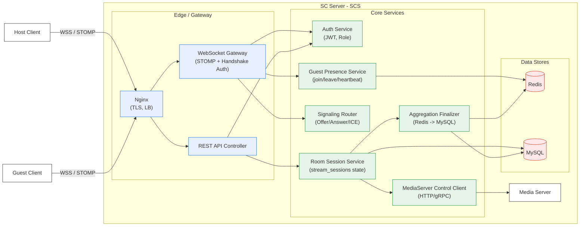
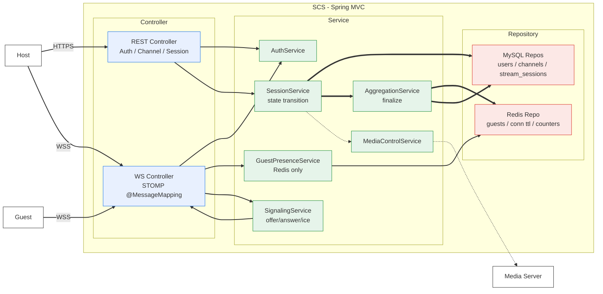
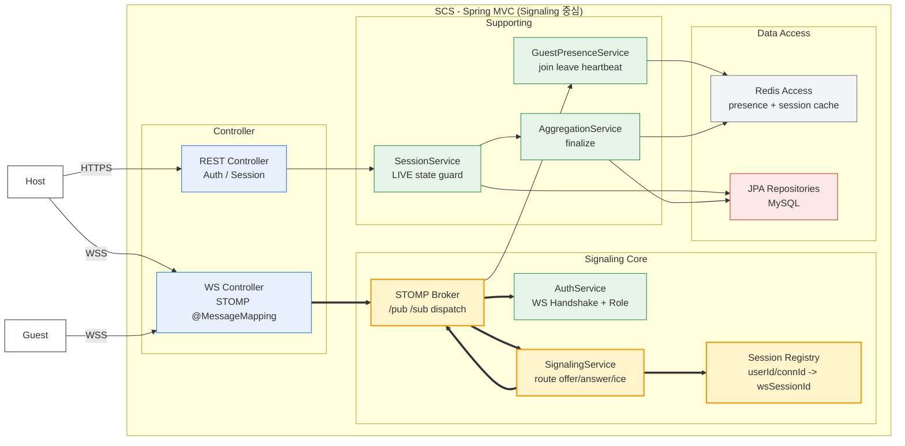
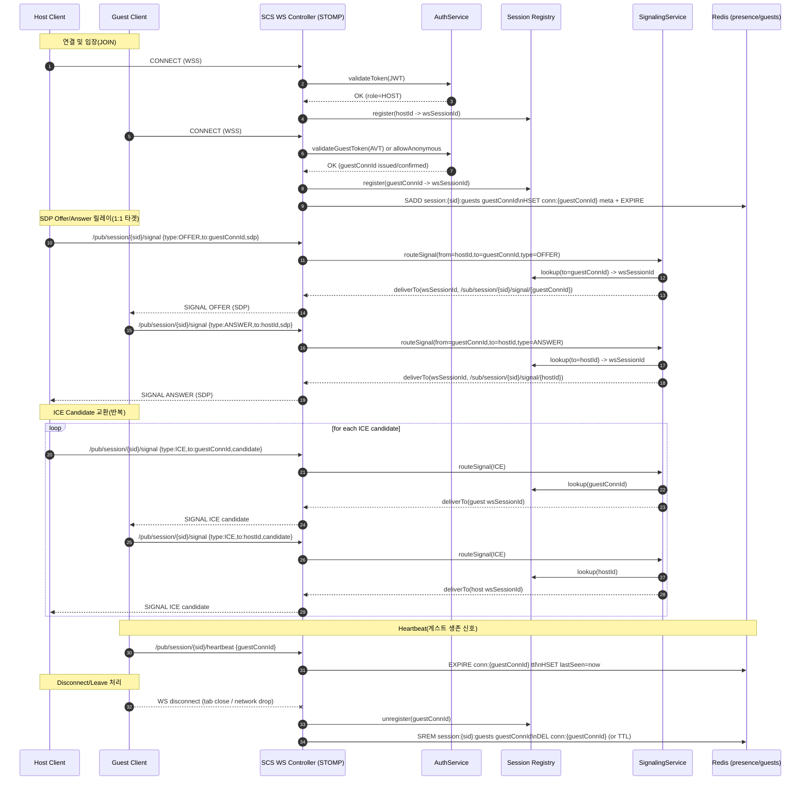

# 시스템 아키텍쳐









## WS 토픽 + 메시지 타입

> 전제: 게스트는 DB에 참가자 row를 만들지 않고, Redis에만 존재한다.
> 
> 
> DB(MySQL)는 `stream_sessions` 및 집계(`viewer_peak`, `viewer_total`)만 최종 반영한다.
> 

### 1) Destination 규칙

- **Publish(클라이언트 → 서버)**: `/pub/session/{sessionId}/...`
- **Subscribe(서버 → 클라이언트)**: `/sub/session/{sessionId}/...`

### 2) 공통 Envelope (권장)

```json
{
"type":"JOIN|LEAVE|HEARTBEAT|OFFER|ANSWER|ICE|ERROR|STATE",
"sessionId":"string",
"from":"hostUserId | guestConnId",
"to":"hostUserId | guestConnId | null",
"payload":{},
"ts":"ISO-8601",
"traceId":"uuid"
}

```

---

### 3) Publish API (Client → SCS)

| 목적 | Destination | type | Auth | 멱등/주의 | payload |
| --- | --- | --- | --- | --- | --- |
| 게스트 입장 | `/pub/session/{sid}/join` | `JOIN` | Guest 허용(AVT 또는 익명) | 중복 JOIN 시 **이미 등록이면 noop** | `{ guestConnId?, userAgent?, ipHash? }` |
| 게스트 퇴장 | `/pub/session/{sid}/leave` | `LEAVE` | Guest 허용 | disconnect로도 처리됨 | `{ guestConnId }` |
| 생존 신호 | `/pub/session/{sid}/heartbeat` | `HEARTBEAT` | Guest 허용 | 주기 5~15s 권장 | `{ guestConnId }` |
| 시그널링(Offer/Answer/ICE) | `/pub/session/{sid}/signal` | `OFFER/ANSWER/ICE` | Host/Guest 모두 | `to` 누락/미등록이면 ERROR | `{ sdp? , candidate? , sdpMid? , sdpMLineIndex? }` |
| 방송 제어(선택) | `/pub/session/{sid}/control` | `STATE` | **Host only** | 중복 start/stop은 서버에서 가드 | `{ action: "START" |

---

### 4) Subscribe API (SCS → Client)

| 목적 | Destination | type | 수신 대상 | payload |
| --- | --- | --- | --- | --- |
| 시그널링 수신(개별 타겟) | `/sub/session/{sid}/signal/{peerId}` | `OFFER/ANSWER/ICE` | 특정 peer(Host or Guest) | publish와 동일 |
| 세션 이벤트(브로드캐스트) | `/sub/session/{sid}/events` | `JOIN/LEAVE/STATE/ERROR` | 세션 구독자 | `{ event, peerId, role?, viewerCount? }` |
| 에러 수신(개별) | `/sub/session/{sid}/errors/{peerId}` | `ERROR` | 특정 peer | `{ code, message, detail? }` |

> peerId는 Host는 userId, Guest는 guestConnId를 사용한다.
> 

---

## Redis 키 스키마 (현재 정책 반영 요약)

- `session:{sid}:guests` = Set(guestConnId)
- `conn:{guestConnId}` = Hash(ipHash, userAgent, joinedAt, lastSeen), TTL
- `session:{sid}:viewer_total_join` = Integer(INCR on first join per connId)
- `session:{sid}:viewer_peak` = Integer(MAX(peak, SCARD(guests)) on join/cleanup)

---

## 구현 체크포인트(팀 공유 시 강조하면 좋은 한 줄)

1. **Registry는 시그널링의 핵심**: `peerId -> wsSessionId` 매핑(단일 인스턴스면 메모리, 확장 시 Redis)
2. **Offer/Answer/ICE는 DB를 절대 타지 않는다**(저지연)
3. **게스트 유령 연결 방지**: heartbeat TTL 기반 정리(없으면 peak/동접 오염)